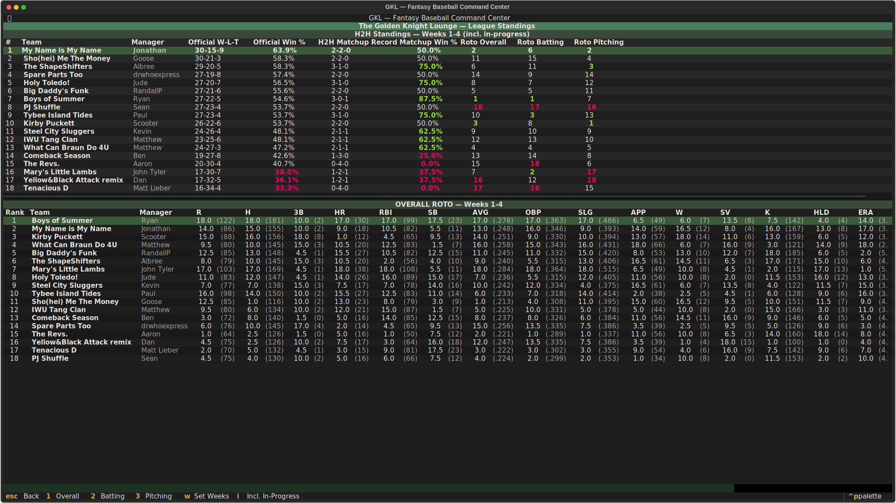
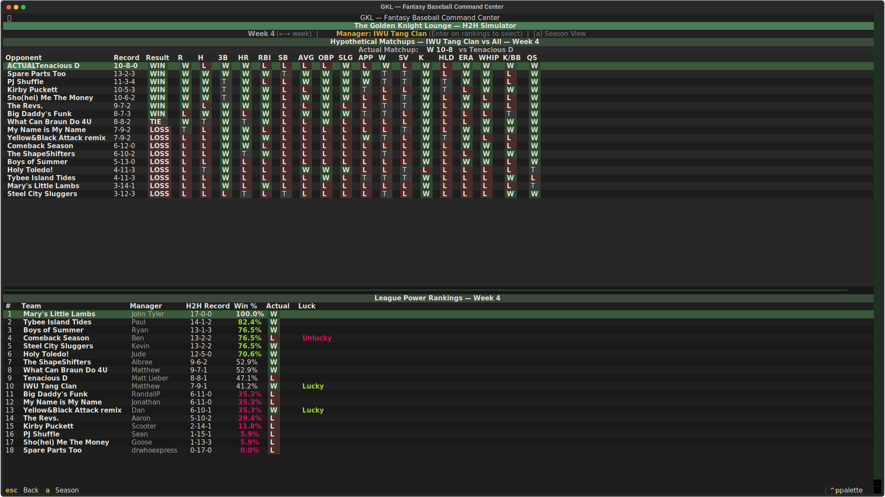
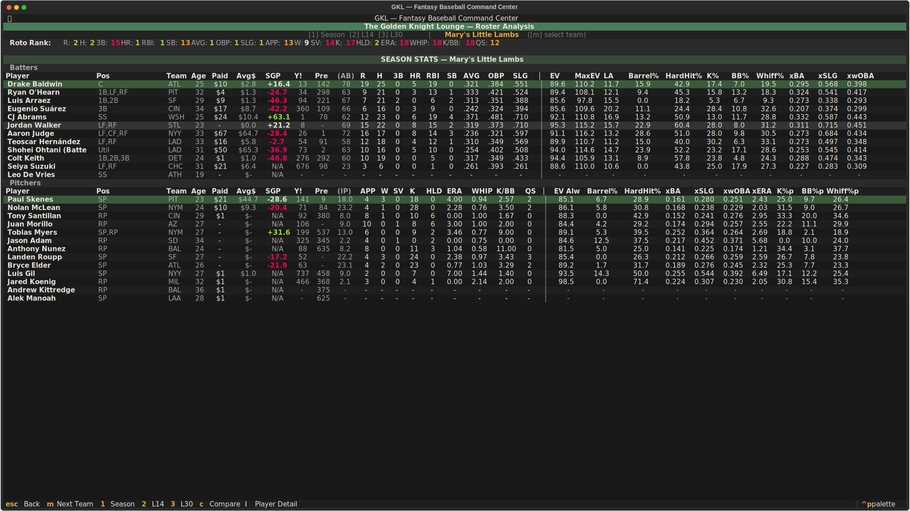
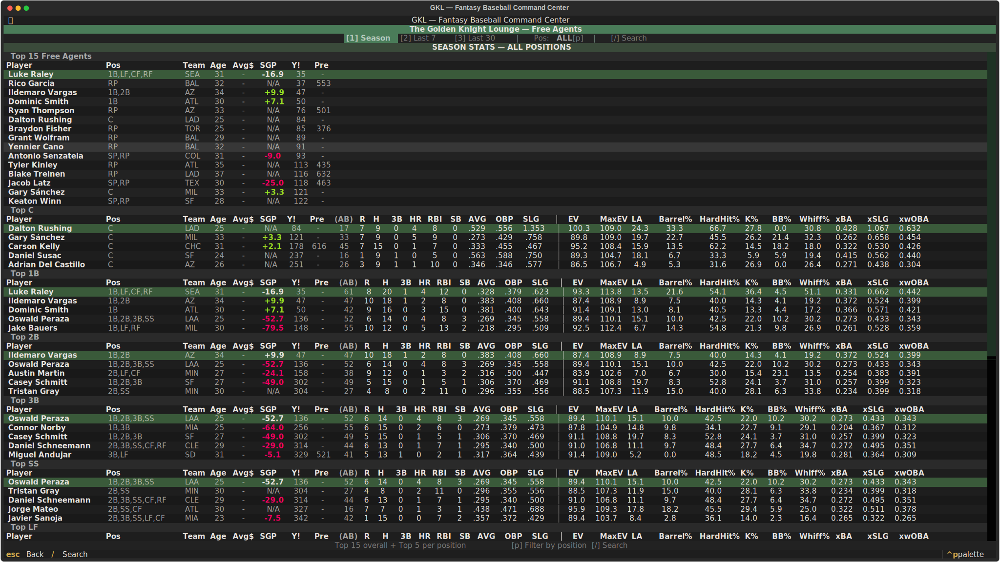
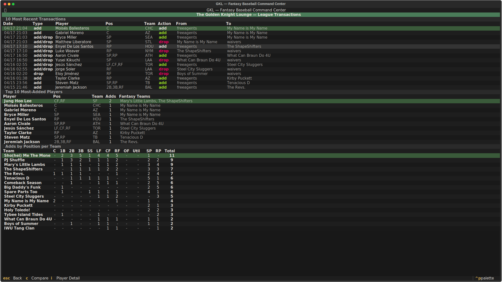
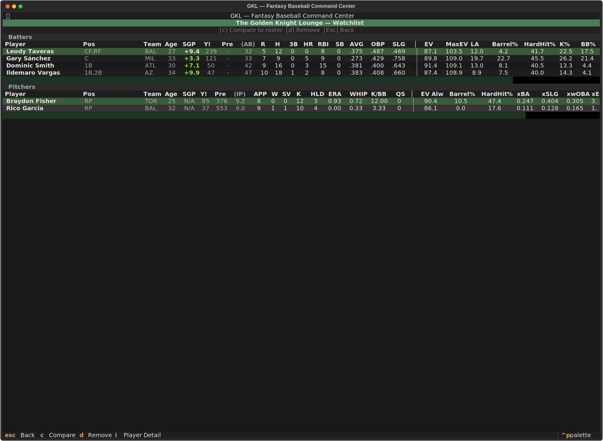
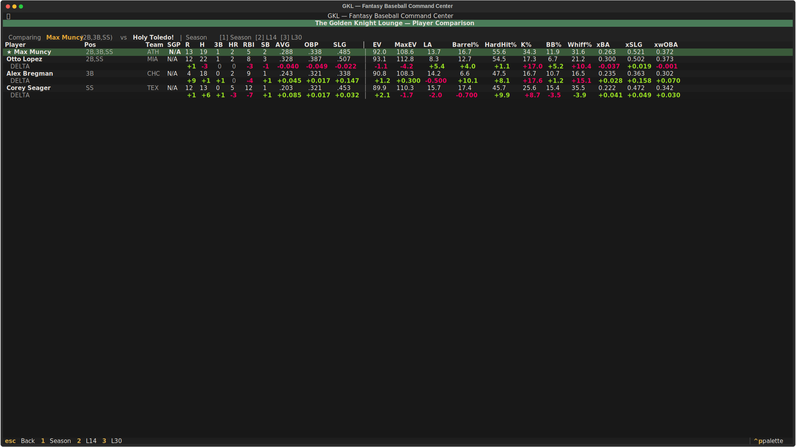
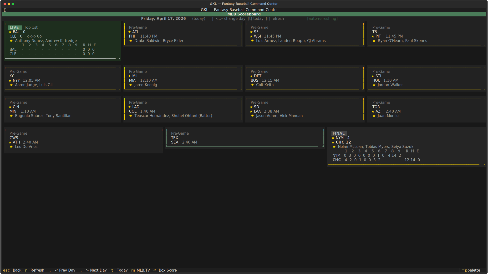
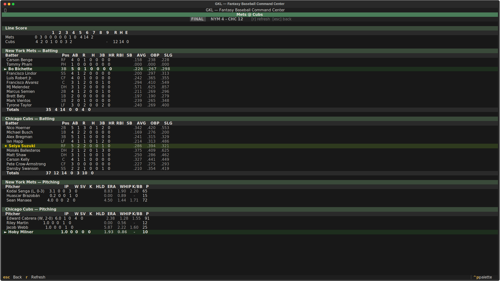
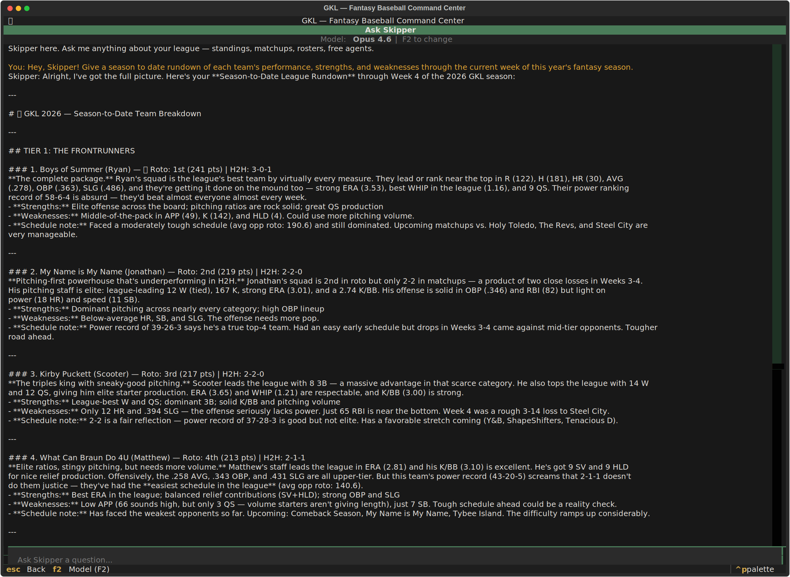

# GKL TUI — Fantasy Baseball Command Center

A terminal-based application for Yahoo Fantasy Baseball leagues. Combines league data, advanced analytics, and real-time MLB scores into a single interface you can run from any terminal — or access from the web at [gklbaseball.com](https://gklbaseball.com).

Built with [Textual](https://github.com/Textualize/textual) for the terminal UI.

## Features

### Matchup Scoreboard

The main screen shows head-to-head matchups for the current week with live scoring across all stat categories. Switch between weekly, daily, and full season views. Navigate weeks with arrow keys or jump to any week directly.

**Key bindings:** `w` weekly | `d` daily | `n` season | `←→` change week | `e` select week


### Roto Standings

Full roto standings with per-category rankings and point totals across all teams. Includes a cumulative roto rank chart showing how each team's position has changed week over week throughout the season.

**Key binding:** `s` from main screen



### Head-to-Head Simulator

Simulates your roster against every other team in the league for any given week. Shows projected win/loss/tie record and identifies which categories you'd win or lose against each opponent. Includes season-long power rankings aggregated across all weeks.

**Key binding:** `h` from main screen



### Roster Analysis

Detailed breakdown of your team's roster with league stats alongside advanced Statcast metrics from Baseball Savant. Includes:

- **SGP (Standings Gain Points):** Measures each player's contribution to your roto standings relative to replacement level
- **Yahoo Rankings:** Current season rank (Y!) and pre-season rank (Pre) for every player
- **Statcast Data:** Exit velocity, barrel rate, hard hit %, expected stats (xBA, xSLG, xwOBA), K%, BB%, and whiff rate
- **Roto Rank Bar:** Your team's ranking in each scoring category at a glance
- **Auction Values:** What you paid vs. average draft cost

Switch between season, last 14 days, and last 30 days. View any team in the league.

**Key binding:** `t` from main screen



### Free Agent Browser

Browse available free agents with the same stats + Statcast data as the roster view. Features:

- **Default view:** Top 15 overall free agents + top 5 at each position (C, 1B, 2B, 3B, SS, LF, CF, RF, SP, RP)
- **Position filter:** Press `p` to filter by a specific position
- **Search:** Press `/` to search by player name
- **Stat views:** Season, last 7 days, or last 30 days
- **Rankings:** Yahoo current and pre-season rankings alongside SGP values

**Key binding:** `f` from main screen



### League Transactions

Explore transaction activity across the league with three views:

- **Recent Transactions:** The 10 most recent adds, drops, and add/drops with timestamps and team details
- **Most-Added Players:** Top 10 players by add count, showing every fantasy team they've appeared on
- **Adds by Position per Team:** Matrix showing how many times each team has added players at each position — useful for spotting roster construction trends

**Key binding:** `x` from main screen



### Player Explorer

Deep-dive into any player's season across the entire league. Search by name to pull up a full ownership and performance breakdown:

- **Usage Summary:** Percentage of weeks started, benched, on IL, or not owned — with aggregated stats for each category
- **Team-by-Team Breakdown:** Stats for every fantasy team that rostered the player, split by weeks started vs. benched
- **Season Timeline:** Month-by-month visual calendar colored by fantasy team ownership, with monthly stat rollups

Search pulls from the Yahoo Fantasy API and caches roster data locally for fast repeat lookups.

**Key binding:** `p` from main screen


### Watchlist

Track free agents you're interested in and compare them head-to-head against players on any team's roster.

**Adding players:** From the Free Agents screen (`f`), highlight a player and press `w` to add or remove them from your watchlist.

**Viewing the watchlist:** Press `l` from the main screen to see all watchlisted players with full stats, Statcast metrics, SGP values, and Yahoo rankings.



### Player Comparison

Highlight any player on any screen and press `c` to compare them against a fantasy team's roster:

- **Available everywhere:** Compare from the Scoreboard, Roster, Free Agents, Transactions, or Watchlist screens — anywhere a player is highlighted in a table
- **Position matching:** Automatically finds all roster players who share the same position(s) as the selected player
- **Side-by-side stats:** League stats and Statcast metrics for both the selected player and each roster player
- **Delta rows:** The difference for every stat between the two players — green means the selected player is better, red means worse
- **SGP delta:** Net standings gain/loss if you made the swap — the most actionable number for roster decisions
- **Directional awareness:** Correctly handles stats where lower is better (ERA, WHIP for pitchers) vs. higher is better (HR, RBI, K%)
- **Stat view switching:** Press `1` for season, `2` for last 14 days, or `3` for last 30 days — all players in the comparison update to the same time window



### MLB Live Scoreboard

Real-time MLB game scores with inline linescores, pitching matchups, and fantasy roster integration. Features:

- **Arrow key navigation:** Move between game cards with arrow keys in a grid layout, with a gold highlight on the focused card
- **Box score on Enter:** Press Enter on any game card to open a full box score with batting and pitching lines
- **Fantasy roster highlights:** Games with your fantasy players are marked with a gold border and star icons showing which of your players are in each game
- **Inline linescores:** Live and final games show inning-by-inning run scoring directly on the card
- **Auto-refresh:** Scoreboard automatically refreshes every 45 seconds when live games are in progress
- **Day navigation:** Browse past and future dates with `,`/`.` keys, or press `t` to jump back to today
- **MLB.TV integration:** Press `m` to open any game's MLB.TV stream in your browser

**Key binding:** `g` from main screen



### Box Score

Full box score view for any MLB game with batting and pitching stats. Fantasy roster players are highlighted so you can quickly spot your players' performances.

**Key binding:** `Enter` on a game card in the MLB Scoreboard, or click on a game card



### Ask Skipper (AI Assistant)

Chat with an AI assistant that has full context on your league — rosters, standings, stats, and matchups. Ask questions about your team, get trade analysis, or explore strategy. Powered by Claude.

Requires an Anthropic API key (entered on first use and saved locally).

**Key binding:** `a` from main screen



### Settings

Configure application preferences including your default team selection.

**Key binding:** `C` (shift+c) from main screen

### Web Access

In addition to the terminal app, GKL is deployed as a web application at [gklbaseball.com](https://gklbaseball.com). Log in with your Yahoo account to access all the same features from any browser — no installation required.

## Installation

Download the latest release for your operating system from the [Releases page](https://github.com/johntylernyc/gkl-cli/releases).

### macOS

```bash
cd ~/Downloads
chmod +x gkl-macos-arm64
./gkl-macos-arm64
```

> If macOS shows a security warning, right-click the file in Finder and select **Open**, or run: `xattr -d com.apple.quarantine gkl-macos-arm64`

### Windows

1. Download `gkl-windows-amd64.exe`
2. Open **Command Prompt** or **PowerShell**
3. Navigate to the download folder and run:

```
cd %USERPROFILE%\Downloads
gkl-windows-amd64.exe
```

### Linux

```bash
cd ~/Downloads
chmod +x gkl-linux-amd64
./gkl-linux-amd64
```

## First-Time Setup

On the first run, the app will guide you through creating Yahoo API credentials:

1. Go to https://developer.yahoo.com/apps/create/
2. Fill in the following:
   - **Application Name:** Choose a name for your application
   - **Description:** A terminal application for managing my fantasy baseball roster
   - **Homepage URL:** Your personal website, or any website formatted as `https://www.example.com`
   - **Redirect URI:** `https://localhost:8080`
   - **OAuth Client Type:** Confidential Client
   - **API Permissions:** Fantasy Sports (Read)
3. After creating the app, Yahoo will provide a **Client ID** and **Client Secret** — paste these into the app when prompted
4. The app will open your browser to authorize access to your Yahoo Fantasy league — approve the request and paste the verification code back into the app

Your credentials are saved locally (`~/.config/gkl/`) so you only need to do this once.

## Keyboard Shortcuts

From the main scoreboard:

| Key | Action |
|-----|--------|
| `s` | Roto Standings |
| `h` | H2H Simulator |
| `t` | Roster Analysis |
| `f` | Free Agents |
| `x` | Transactions |
| `p` | Player Explorer |
| `l` | Watchlist |
| `g` | MLB Scoreboard |
| `a` | Ask Skipper (AI) |
| `c` | Compare player to roster |
| `i` | Player Detail |
| `w` | Weekly stats view |
| `d` | Daily stats view |
| `n` | Season stats view |
| `←` `→` | Previous/next week |
| `e` | Select specific week |
| `L` | Switch league |
| `C` | Settings |
| `r` | Refresh data |
| `q` | Quit |

All sub-screens: `Escape` or `q` to go back.

## Data Sources

- **League data:** [Yahoo Fantasy Sports API](https://developer.yahoo.com/fantasysports/guide/)
- **Advanced metrics:** [Baseball Savant / Statcast](https://baseballsavant.mlb.com/)
- **Live scores:** [MLB Stats API](https://statsapi.mlb.com/)

## Development

Requires Python 3.12+.

```bash
# Clone and install
git clone https://github.com/johntylernyc/gkl-cli.git
cd gkl-cli
uv sync

# Run
uv run gkl

# Run tests
uv run pytest
```
